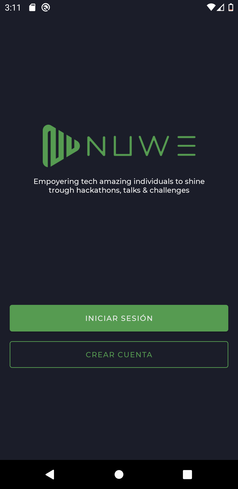
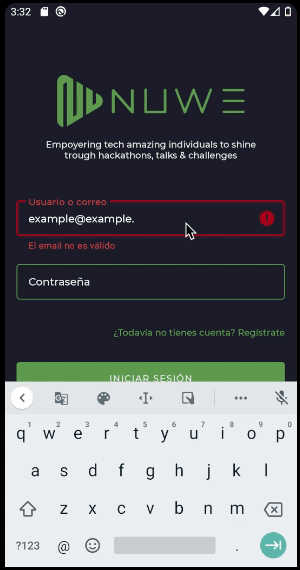
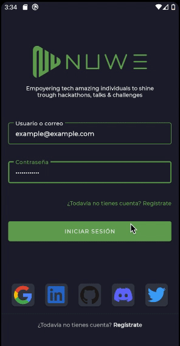
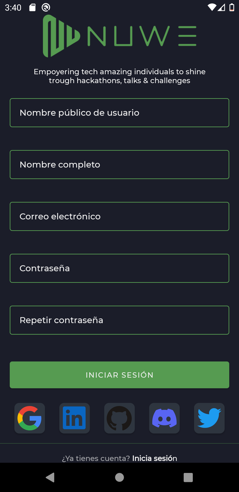
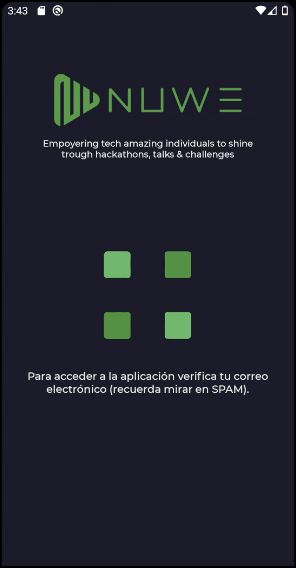

# Login Nuwe - [Reto Semana 1](https://nuwe.io/challenge/reto-mobile-individual-semana-1)

## Definición del proyecto:

El reto consta de cuatro pantallas, en ellas podremos registrarnos, logearnos e incluso validar la cuenta.1
Este proyecto ha sido creado en menos de una semana, siguiendo buenas prácticas y todas las recomendaciones de Google.

## Características del proyecto:

- Arquitectura MVVM.
- *Clean Architecture*
- *SOLID*
- Corrutinas
- Inyección de dependencias con *Dagger Hilt*
- Firebase (Tanto para login como para persistir en base de datos *realTime*)
- Splash optimizado
- LiveData
- Flows
- StateFlow
- Vistas reutilizables y TODO creado con *Constraint Layout* para optimizar los recursos de la UI
- Diseños y estilos creados para la reutilización por todo el proyecto

## Pantalla de introducción
La primera pantalla nos servirá de navegador hacia el login o el registro. Como curiosidad el *splash* está optimizado para evitar el típico *delay* inicial en blanco.
TODAS las navegaciones usar un *wrapper* event para optimizar más el livedata en eventos de una única acción.

## Pantalla de login

Aquí podremos iniciar sesión. Además comprobará si la cuenta ha sido verificada para acceder al supuesto detalle (no pedido en la prueba) o a la pantalla de verificación.

El control de errores se ejecuta de dos formas distintas. En tiempo real, cada vez que uno de los campos pierde el foco o se actualiza. Y una gestión secundaria por si el login no hace *match* en la base de datos.

Además la propia UI se actualiza reactivamente a través de su propio *StateFlow*.

## Pantalla de registro

En esta pantalla tendremos que rellenar un formulario con validaciones similares a la pantalla del login. Si todo es correcto nos registrará y además creará en una tabla de la base de datos de *Firebase* un documento para dicho usuario donde almacenará el *nickName*, nombre completo y email.

También dispone de un *scroll* ya que al ser tan larga puede acortarse en dispositivos pequeños.

## Verificación de cuenta

Cuando el usuario hace *login* o se registra le llevaremos a una pantalla que mandará un mail al usuario para que verifique la cuenta y se quedará suscrito a cambios para que una vez lo acepte, en un perioro máximo de un segundo, la vista se modifique mostrando un botón para acceder al suspuesto detalle.

También hay una animación implementada con *lottie*.

## FAQ

- ¿No usas *fragments*?
  - Creo que se abusa de los *fragments*, todas estas pantallas no comparten lógica por la cual podríamos aprovechar, por lo que creo que lo mejor es usar distintas *activities*.

- Pero... ¿Hay vistas similares, no?
  - Sí, es por ello que las vistas que son iguales se han abstraido para reutilizarlas en todas partes.
  
## COLABORA.

Este proyecto es totalmente GRATUITO por lo que puedes aportar tu grano de arena de múltiples formas.

- Dale a FAV al proyecto (Star)
- Sígueme en mis [redes sociales](https://aristi.dev)
- Nomíname a [GITHUB STAR](https://stars.github.com/nominate/)
